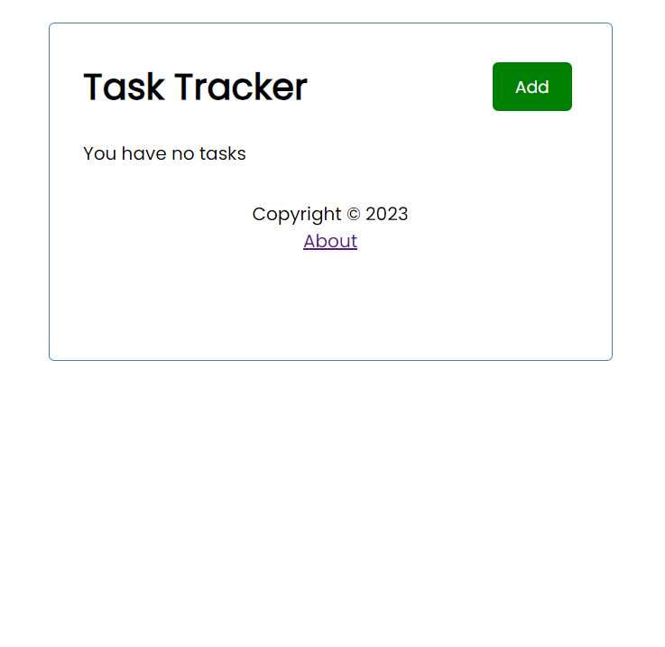
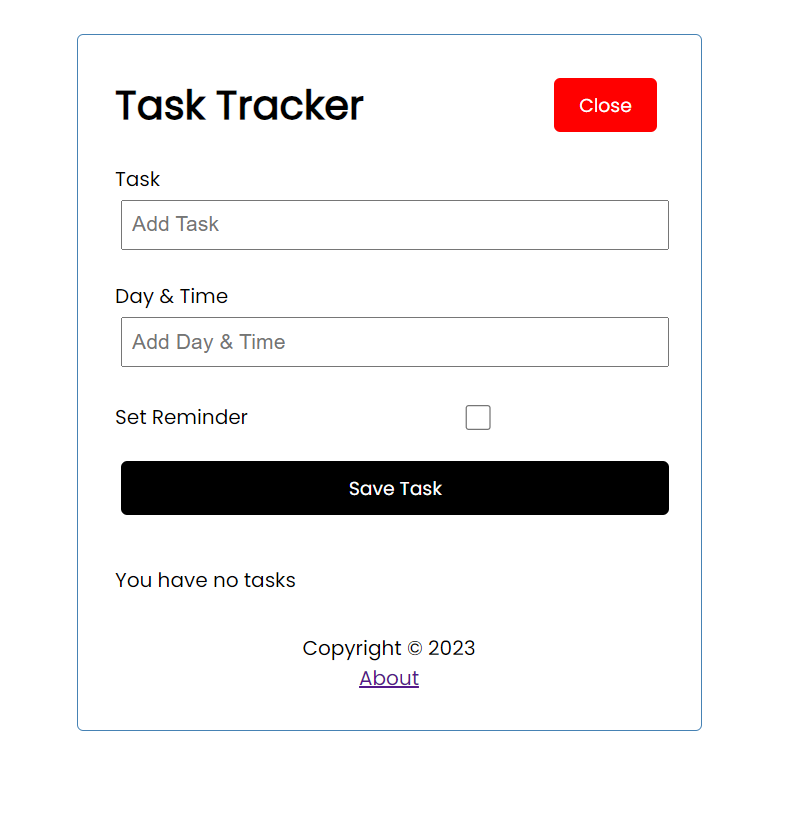
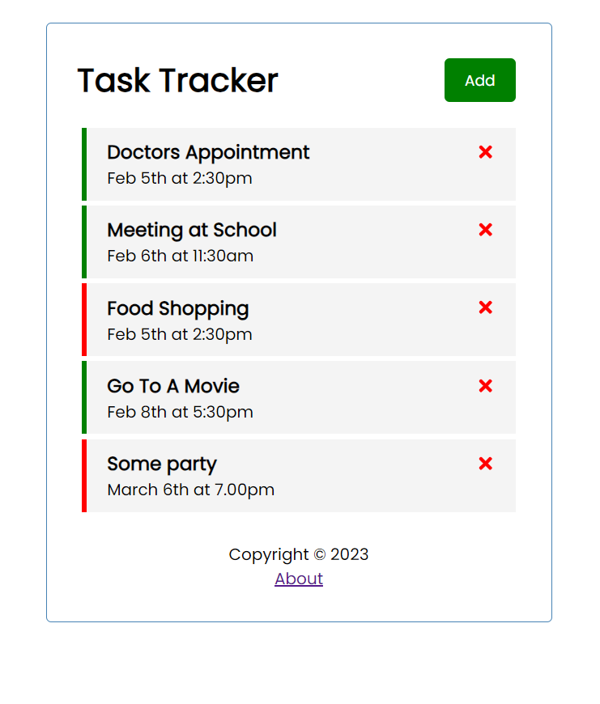
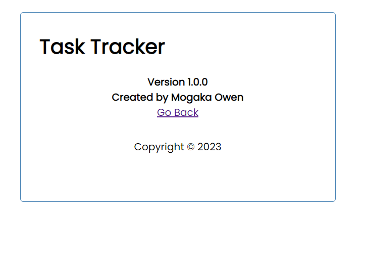

# Task Tracker App Using React JS

## In this project, a simple task tracker app was developed using react js for frontend and json server to simulate backend conditions

### This project was also done using angular and can be found in the Task-Tracker repository

##### The application looks as follows without a single task

---

##### To add a task, the following form is generated after clicking the add button to input a task

---

##### The application looks as follows with tasks added

The green means tasks with a reminder and the red ones are tasks without a reminder

---

Clicking on the About link takes you to the about page with a go back functionality as shown

